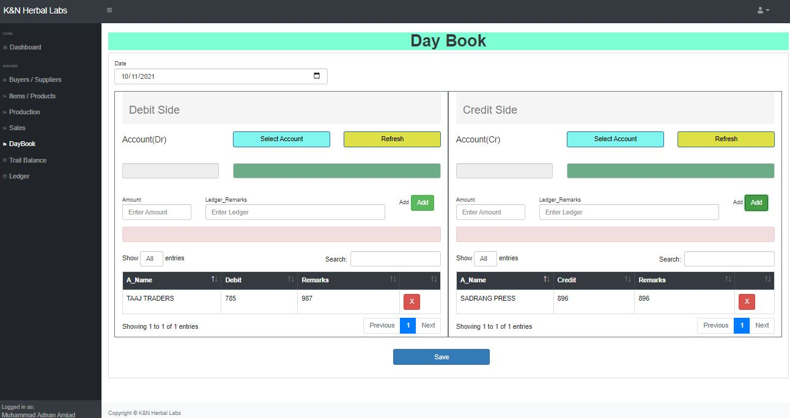

# Flask Kn-Herbal   -  __Stock-DailyBook-Management-SAAS-CMS__


## Introduction
This project is live on Heroku Server at [Kn-Herbal](https://kn-herbal.herokuapp.com/), written in flask with Mongo-DB. 

## ScreenShot

<table align="center">
    <tr>
        <td align="center">
            <a href="https://raw.githubusercontent.com/UsamaChattha/Stock-DailyBook-Management-SAAS-CMS/main/ScreenShot/login.JPG">
                
            </a>
        </td>
        <td align="center">
            <a href="https://raw.githubusercontent.com/UsamaChattha/Stock-DailyBook-Management-SAAS-CMS/main/ScreenShot/BuyerSupplier.JPG">
                
            </a>
        </td>
                <td align="center">
            <a href="https://raw.githubusercontent.com/UsamaChattha/Stock-DailyBook-Management-SAAS-CMS/main/ScreenShot/Item.JPG">
                
            </a>
        </td>
    </tr>
    <tr>
        <td align="center">
            <a href="https://raw.githubusercontent.com/UsamaChattha/Stock-DailyBook-Management-SAAS-CMS/main/ScreenShot/Sale1.JPG">
                
            </a>
        </td>
        <td align="center">
            <a href="https://raw.githubusercontent.com/UsamaChattha/Stock-DailyBook-Management-SAAS-CMS/main/ScreenShot/Sale2.JPG">
                
            </a>
        </td>
                <td align="center">
            <a href="https://raw.githubusercontent.com/UsamaChattha/Stock-DailyBook-Management-SAAS-CMS/main/ScreenShot/sale3.JPG">
                
            </a>
        </td>
    </tr>
        <tr>
        <td align="center">
            <a href="https://raw.githubusercontent.com/UsamaChattha/Stock-DailyBook-Management-SAAS-CMS/main/ScreenShot/DayBook1.JPG">
                
            </a>
        </td>
        <td align="center">
            <a href="https://raw.githubusercontent.com/UsamaChattha/Stock-DailyBook-Management-SAAS-CMS/main/ScreenShot/DayBook2.JPG">
                
            </a>
        </td>
                <td align="center">
            <a href="https://raw.githubusercontent.com/UsamaChattha/Stock-DailyBook-Management-SAAS-CMS/main/ScreenShot/DayBook3.JPG">
                
            </a>
        </td>
    </tr>
        <tr>
        <td align="center">
            <a href="https://raw.githubusercontent.com/UsamaChattha/Stock-DailyBook-Management-SAAS-CMS/main/ScreenShot/Production.JPG">
                
            </a>
        </td>
        <td align="center">
            <a href="https://raw.githubusercontent.com/UsamaChattha/Stock-DailyBook-Management-SAAS-CMS/main/ScreenShot/TrailBalance.JPG">
                
            </a>
        </td>
                <td align="center">
            <a href="https://raw.githubusercontent.com/UsamaChattha/Stock-DailyBook-Management-SAAS-CMS/main/ScreenShot/Ledger.JPG">
                
            </a>
        </td>
    </tr>
</table>


## Quickstart

### Use python virtual environment
**First, Clone and Install dependence**
```
git clone https://github.com/UsamaChattha/Stock-DailyBook-Management-SAAS-CMS.git
cd Kn-Herbal
python3 -m venv .venv
# on windows, you should run .venv\Scripts\activate.bat 
source .venv/bin/activate
pip3 install -r requirements.txt
```

<!-- **Second, Init db and run**
```
# modify .flaskenv and flaskshop/setting.py
flask createdb
flask seed
flask run
``` -->

### Use Pycharm 
**First, Create New Prject and Install Dependencies Using the follwoing Command inside terminal**
```
pip3 install -r requirements.txt
```
<!-- **Second, enter container and add fake data**
```
docker-compose exec web sh
flask createdb
flask seed
``` -->
### About Config of Database
```
Add database connection string in the configuration
```
<!-- If the js files has been modified, you need to:


Redis and Elasticsearch is unabled by default, You can enable them for good performence and search ablitity. -->